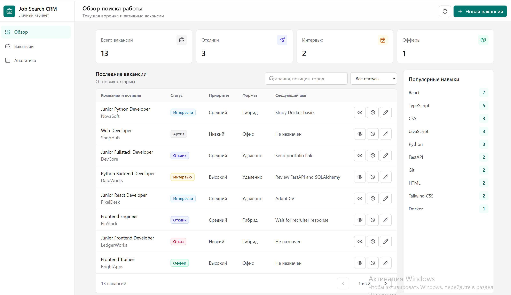
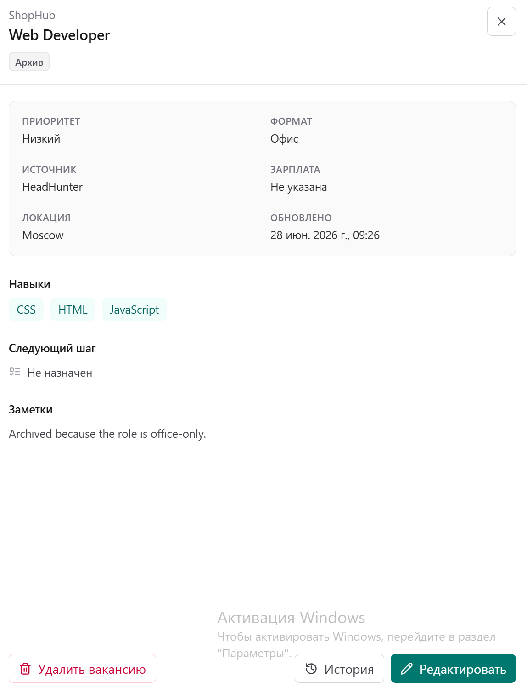
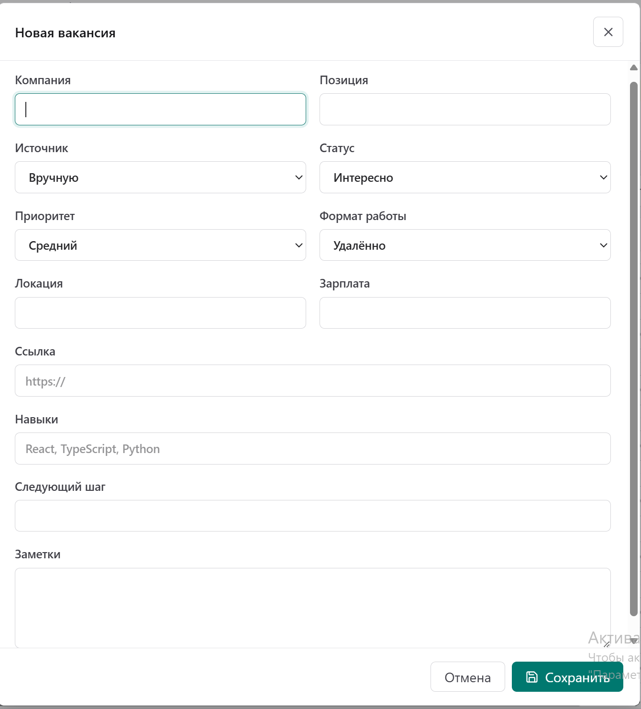
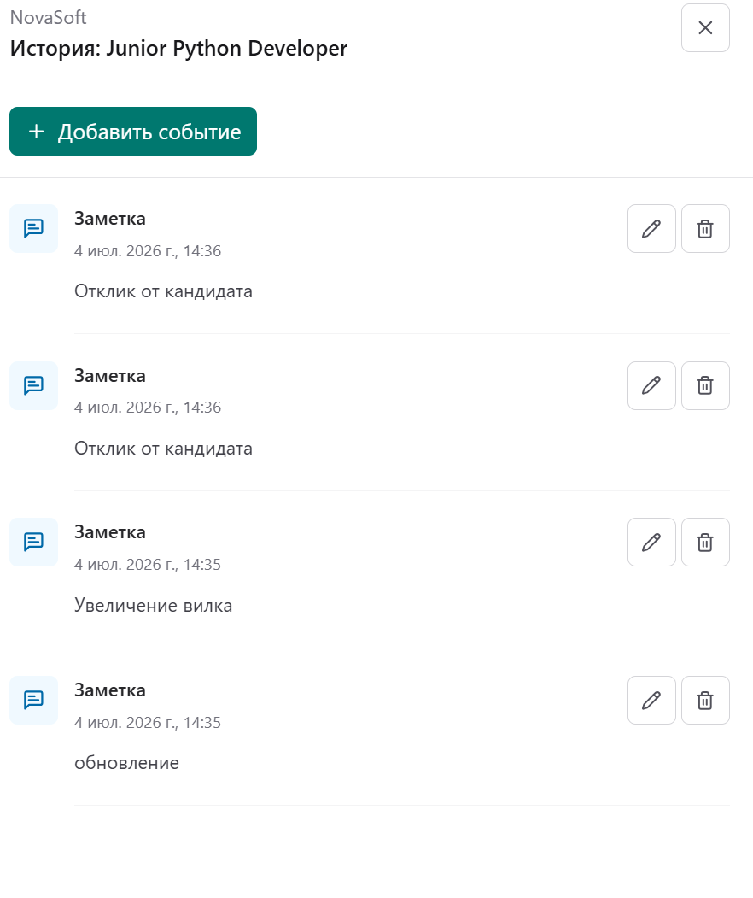

# Job Search CRM mockup

Job Search CRM is a full-stack application for tracking job opportunities,
contact history, and job search analytics.

## Architecture

```text
React + TypeScript
        |
        | HTTP /api
        v
FastAPI routes -> services -> SQLAlchemy -> SQLite / PostgreSQL
        |
        +-> statistics by status, priority, and skill
```

- The frontend provides the dashboard, filters, vacancy forms, and activities.
- The backend stores data, validates the API contract, and calculates statistics.
- Alembic manages the SQLite and PostgreSQL database schemas.
- Separate GitHub Actions workflows validate the backend and frontend.

## Interface

### Dashboard



### Vacancy details



### Vacancy form



### Interaction history



## Documentation

- [Local backend and frontend setup](docs/local-development.md)
- [Database, Alembic, and PostgreSQL](docs/database.md)
- [Seeding the database with demo data](docs/seed-data.md)

## Project structure

- `backend` — FastAPI, SQLAlchemy, SQLite/PostgreSQL, and Alembic
- `frontend` — React, TypeScript, Vite, and Tailwind CSS
- `maket` — original static interface mockup

Run instructions are available in `backend/README.md` and
`frontend/README.md`.

Quick start from Git Bash or WSL:

```bash
bash start.sh
```

## Current stage

Stage 9: MVP stabilization and portfolio preparation.

Completed:

- React and TypeScript application
- Tailwind CSS and Lucide icons
- typed API client
- dashboard with statistics and popular skills
- vacancy list with search, status filtering, and pagination
- API loading and error states
- Alembic migrations
- PostgreSQL environment through Docker Compose
- vacancy activity history
- normalized `Skill` and `vacancy_skills` models
- vacancy creation and editing in the frontend
- full vacancy details and vacancy deletion in the frontend
- viewing and managing activities in the frontend
- component tests for the main user workflows
- frontend CI with ESLint, Vitest, and a production build
- PostgreSQL 18 smoke test covering migrations, seed data, and key API endpoints
- portfolio screenshots

Next stage:

- finalize the portfolio description and roadmap
- tag the finished MVP as version 1.0
